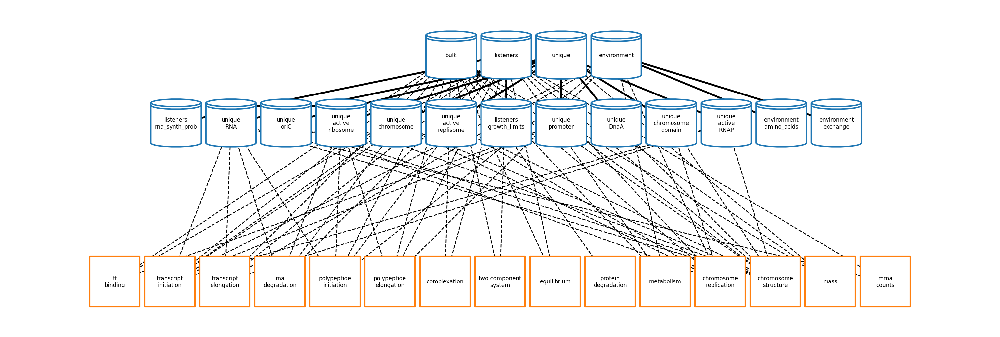

# Vivarium *E. coli*



## Background

Vivarium *E. coli* is a port of the Covert Lab's 
[E. coli Whole Cell Model](https://github.com/CovertLab/wcEcoli) (wcEcoli)
to the [Vivarium framework](https://github.com/vivarium-collective/vivarium-core).

As in wcEcoli, raw experimental data (`reconstruction/ecoli/flat`) is first processed
by the parameter calculator or Parca (`reconstruction/ecoli/fit_sim_data_1.py`) to calculate 
model parameters (e.g. transcription probabilities).

These parameters are used to configure processes (`ecoli/processes`) that are linked together
into a complete simulation in accordance with the topology generated by
`ecoli/experiments/ecoli_master_sim.py`.

For more details, refer to the [user guide](https://covertlab.github.io/vivarium-ecoli/index.html).

## Installation

> **Note:** The following instructions assume a Linux or MacOS system. Windows users can
> attempt to follow the same instructions after setting up 
> [Windows Subsystem for Linux](https://learn.microsoft.com/en-us/windows/wsl/install).

pyenv lets you install and switch between multiple Python releases and multiple "virtual 
environments", each with its own pip packages. Using pyenv, create a virtual environment 
and install Python 3.11.3. For a tutorial on how to create a virtual environment, follow 
the instructions [here](https://github.com/CovertLab/wcEcoli/blob/master/docs/create-pyenv.md) 
and stop once you reach the "Create the 'wcEcoli3' python virtual environment" step. Then, 
run the following command in your terminal:

    pyenv virtualenv 3.11.3 viv-ecoli && pyenv local viv-ecoli

Update `pip`, `setuptools` and `wheel` to avoid issues with these:

    pip install --upgrade pip setuptools wheel

Now, install numpy (check `requirements.txt` for the exact version):

    pip install numpy==1.26.4

Then install the remaining requirements:

    pip install -r requirements.txt

And build the Cython components:

    make clean compile

## Running the simulation

To run the simulation, set the `PYTHONPATH` environment variable to the cloned repository and run
`ecoli_master_sim.py`. If you are at the top-level of the cloned repository, invoke:

    # Must set PYTHONPATH and OMP_NUM_THREADS for every new shell
    export PYTHONPATH=.
    export OMP_NUM_THREADS=1
    python ecoli/experiments/ecoli_master_sim.py

For details on configuring simulations through either the command-line interface or .json files, 
see the [Ecoli-master configurations readme](readmes/ecoli_configurations.md).

## Benefits of Vivarium

The main motivation behind the migration is to modularize the processes and allow them to be run 
in new contexts or reconfigured or included in different biological models. 

There are three main aspects to the migration:

* Decoupling each process from `sim_data` so they can be instantiated and run independently of 
the assumptions made in the structure of the `sim_data` object. This allows each process to be 
reconfigured into new models as well as ensuring each process has the ability to run on its own. 
Each process now has parameters declared for each class that can be provided at initialization time. 

* Refactoring access to `Bulk-` and `UniqueMolecules` into the `ports_schema()` declaration used 
by Vivarium. This turns each process's state interactions into explicit declarations of properties 
and attributes. These declarations allow the processes to be recombined and to be expanded with 
new properties as needed. It also frees the processes from having to conform to the `Bulk/Unique` 
dichotomy and provides a means for other kinds of state (previously implemented by reading from 
listeners or accessing other process class's attributes), further promoting decoupling. This declared 
schema is then used as a structure to provide the current state of the simulation to each process's 
`next_update(timestep, states)` function during the simulation.

* Translating all state mutation from inside the processes into the construction of a Vivarium 
`update` dictionary which is returned from the `next_update(timestep, states)`. The structure of 
this update mirrors the provided `states` dictionary and the declared `ports_schema()` structure. 
This allows each process to operate knowing that values will not be mutated by other processes before 
it sees them, a fundamental requirement for modular components.

The way Vivarium state updates work, all states are provided as they appear at the beginning of each 
process's update timestep, and then are applied at the end of that timestep. This ensures all states 
are synchronized between processes.

## Causality Network

> **Note:** Must be a member of the `CovertLab` GitHub organization.

[The Causality visualization tool](https://github.com/CovertLab/causality) can be used to manually examine the model's
output (molecule counts, reaction fluxes, etc.). First, [run a simulation](#running-the-simulation) ensuring that data is set to be emitted to MongoDB (e.g. `emitter` is `database` in [configuration](readmes/ecoli_configurations.md)). Then, build the Causality network with the following command:

```
python ecoli/analysis/buildCausalityNetwork.py
```

Then, clone the Causality repository into the same folder as the vivarium-ecoli repository (e.g. `/dev/causality` and `/dev/vivarium-ecoli`) and follow the installation instructions.

Finally, start the Causality server, which will open an interactive webpage in your web browser:

```
cd /dev/causality
python site/server.py ../vivarium-ecoli/out/seriesOut/
```
